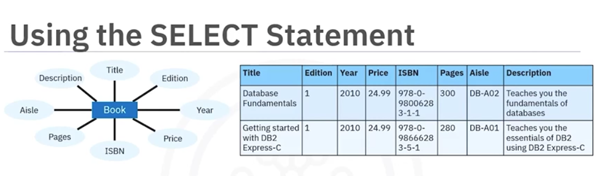
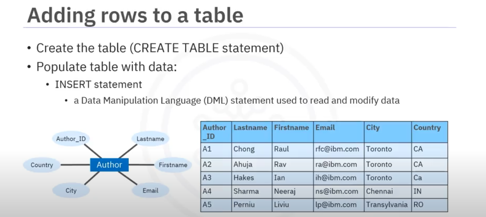

# Course Overview

The course is structured into 6 weeks, each focusing on a specific topic. 

## Week 1: Getting started with SQL 
This week will let you learn the basics of SQL and databases. You will also learn how to query tables in a database. 

## Week 2: Introduction to Relational Databases and Tables 
This week is all about relational databases, creating tables, and modifying their contents. 

## Week 3: Intermediate SQL 
In this module, you will learn more about different types of SQL queries, functions, string patterns, grouping, and sorting. 

## Week 4: Accessing databases with Python 
This week, you will learn the nuances of accessing databases using Python libraries and SQL magic in Jupyter Notebooks. 

## Week 5: Course Assignment 
This week is designed to give you an understanding of how to deal with real-world datasets and complete an assignment which tests your skills acquired throughout the course.  

## Week 6: Bonus Module: Advanced SQL for Data Engineers
In this additional module, you will learn how to apply advanced queries in SQL, like Views, Stored Procedures, and ACID transactions. 


# Week 1
## Getting started with SQL 

**SELECT:**
```SELECT QUERY
SELECT * FROM <TABLE_NAME>
```




#### Useful SQL Statements

**COUNT:**

```COUNT QUERY
SELECT COUNT(*) FROM <TABLE_NAME>;
```

**DISTINCT:**

```DISTINCT QUERY
SELECT DISTINCT <COLUMN> FROM <TABLE_NAME>;
```

**LIMIT:**

```LIMIT QUERY
SELECT * FROM <TABLE_NAME> LIMIT 10;
```

**INSERT:**

```INSERT QUERY
INSERT INTO <TABLE_NAME> 
(<COLUMN_NAME>, <COLUMN_NAME2>, <COLUNM_NAMEX>...) 
VALUES (<VALUE1>, <VALUE2>, <VALUEX>...)
```


**UPDATE:**
```INSERT QUERY
UPDATE <TABLE_NAME> SET <COLUMN_NAME>=<VALUE> WHERE <CONDITION>
```

OBS: The condidion almost be every time will be a primary key.