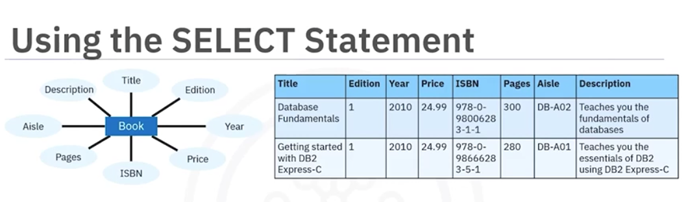
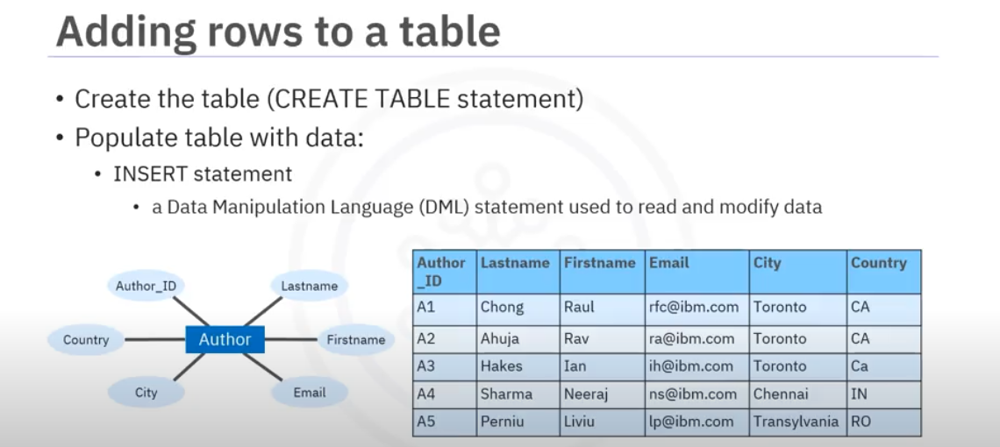

# Course Overview

The course is structured into 6 weeks, each focusing on a specific topic. 

## Week 1: Getting started with SQL 
This week will let you learn the basics of SQL and databases. You will also learn how to query tables in a database. 

## Week 2: Introduction to Relational Databases and Tables 
This week is all about relational databases, creating tables, and modifying their contents. 

## Week 3: Intermediate SQL 
In this module, you will learn more about different types of SQL queries, functions, string patterns, grouping, and sorting. 

## Week 4: Accessing databases with Python 
This week, you will learn the nuances of accessing databases using Python libraries and SQL magic in Jupyter Notebooks. 

## Week 5: Course Assignment 
This week is designed to give you an understanding of how to deal with real-world datasets and complete an assignment which tests your skills acquired throughout the course.  

## Week 6: Bonus Module: Advanced SQL for Data Engineers
In this additional module, you will learn how to apply advanced queries in SQL, like Views, Stored Procedures, and ACID transactions. 


# Week 1
## Getting started with SQL 

**- SELECT**
```SELECT QUERY
SELECT * FROM <TABLE_NAME>
```




#### Useful SQL Statements

**- COUNT**

```COUNT QUERY
SELECT COUNT(*) FROM <TABLE_NAME>;
```

**- DISTINCT**

```DISTINCT QUERY
SELECT DISTINCT <COLUMN> FROM <TABLE_NAME>;
```

**- LIMIT**

```LIMIT QUERY
SELECT * FROM <TABLE_NAME> LIMIT 10;
```

**- INSERT**

```INSERT QUERY
INSERT INTO <TABLE_NAME> 
(<COLUMN_NAME>, <COLUMN_NAME2>, <COLUNM_NAMEX>...) 
VALUES (<VALUE1>, <VALUE2>, <VALUEX>...)
```


**- UPDATE**
```UPDATE QUERY
UPDATE <TABLE_NAME> SET <COLUMN_NAME>=<VALUE> WHERE <CONDITION>
```

OBS: The condidion almost be every time will be a primary key, in modern Data Pipelines is very used too a timestamp column following the primary key.

**- DELETE**
```DELETE QUERY
DELETE FROM <TABLE_NAME> WHERE <COLUMN_NAME> = <CONDITION>
```

# Week 2
## Relational Database Concepts

**- CREATE TABLE**

```CREATE TABLE QUERY
CREATE TABLE <TABLE_NAME> (
   COLUMN1 datatype,
   COLUMN2 datatype,
   COLUMN3 datatype, 
   ...
);
```

**- DROP TABLE**
```
DROP TABLE <TABLE_NAME>;
```

**- TRUNCATE TABLE**
```
TRUNCATE TABLE <TABLE_NAME>;
```

## Understanding Relational Model Constraints

In any well-designed database, maintaining data integrity is essential to ensure the accuracy, consistency, and reliability of the stored information. This lab focuses on three key relational model constraints:

- Entity Integrity
- Referential Integrity
- Domain Integrity

These constraints enforce rules on how data is stored and related within tables.

Imagine you are building a Database BookShopDB. You need to ensure that:

1. Each book and author has a unique identifier.

2. Every book must be linked to a valid author.

3. Attributes like price, title, and date must have values within an acceptable range and format.

This reading will walk you through these constraints with examples to solidify your understanding.

## Types of relational model constraints

### Entity integrity constraint

This constraint ensures that every table in a relational database has a primary key. A primary key uniquely identifies each row in the table. A primary key column(s):

- must not contain NULL values
- must be unique across all rows

This constraint guarantees that each record (or entity) in a table is distinct and identifiable, preventing duplication and missing identifiers.

### Referential integrity constraint

This constraint ensures that a foreign key in one table always refers to a valid primary key in another table. This maintains consistent and meaningful relationships between tables.

It enforces the logical link between related data in different tables, preventing the existence of invalid or "orphaned" references.

### Domain integrity constraint

This constraint ensures that all values stored in a column fall within a defined domain. This includes rules about:

- Data type
- Format
- Allowed values
- Nullability

It helps ensure that data in a column is valid, logical, and consistent with its intended use.

## Create Table, Alter, Drop, Truncate - Cheat Sheet 

| Command               | Syntax                                                                                                | Description                                                                                             | Example                                                                 |
|-----------------------|-------------------------------------------------------------------------------------------------------|---------------------------------------------------------------------------------------------------------|-------------------------------------------------------------------------|
| CREATE TABLE          | `CREATE TABLE table_name (col1 datatype optional_keyword, col2 datatype optional_keyword, ...)`       | Creates a table. Each column is specified with its name, data type, and optional keywords like PRIMARY KEY or NOT NULL. | `CREATE TABLE employee (employee_id CHAR(2) PRIMARY KEY, first_name VARCHAR(30) NOT NULL, mobile INT);` |
| ALTER TABLE - ADD COLUMN | `ALTER TABLE table_name ADD column_name datatype;` (Option 1) <br> `ALTER TABLE table_name ADD COLUMN column_name datatype;` (Option 2) | Adds one or more columns to a table.                                                                    | `ALTER TABLE employee ADD income BIGINT;` <br> `ALTER TABLE employee ADD COLUMN income BIGINT;`        |
| ALTER TABLE - ALTER COLUMN | MySQL: `ALTER TABLE table_name MODIFY column_name new_data_type;` <br> DB2: `ALTER TABLE table_name ALTER COLUMN column_name SET DATA TYPE new_data_type;` | Modifies the data type of an existing column.                                                           | MySQL: `ALTER TABLE employee MODIFY mobile CHAR(20);` <br> DB2: `ALTER TABLE employee ALTER COLUMN mobile SET DATA TYPE CHAR(20);` |
| ALTER TABLE - DROP COLUMN | `ALTER TABLE table_name DROP COLUMN column_name;`                                                    | Removes a column from a table.                                                                          | `ALTER TABLE employee DROP COLUMN mobile;`                              |
| ALTER TABLE - RENAME COLUMN | MySQL: `ALTER TABLE table_name CHANGE COLUMN old_name new_name datatype [optional_keywords];` <br> DB2: `ALTER TABLE table_name RENAME COLUMN old_name TO new_name;` | Renames a column in a table.                                                                            | MySQL: `ALTER TABLE employee CHANGE COLUMN first_name name VARCHAR(255);` <br> DB2: `ALTER TABLE employee RENAME COLUMN first_name TO name;` |
| TRUNCATE TABLE        | MySQL: `TRUNCATE TABLE table_name;` <br> DB2: `TRUNCATE TABLE table_name IMMEDIATE;`                  | Deletes all rows in a table. DB2 requires the IMMEDIATE keyword to process the statement immediately and irreversibly. | MySQL: `TRUNCATE TABLE employee;` <br> DB2: `TRUNCATE TABLE employee IMMEDIATE;` |
| DROP TABLE            | `DROP TABLE table_name;`                                                                              | Deletes a table and all its data from the database.                                                     | `DROP TABLE employee;`                                                  |

# Week 3


